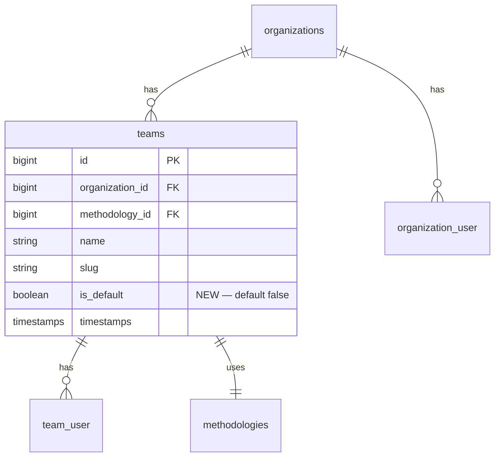

# Default team per organization with central membership service

## Overview

При создании организации в системе сейчас не создаётся ни одной команды, и пользователи (создатель, приглашённые через онбординг, через invite) попадают только в `organization_user`, но не в `team_user`. Это блокирует функционал, требующий `team_id`: TaskDataUpload, manual TranscriptUpload, GenerateFollowup pipeline, AgentTask с team scope, FollowupController, шаблоны (AgendaTemplate / MeetingSummaryTemplate), CriticalPath и др.

**Цель:** при создании организации автоматически создавать одну «дефолтную» команду (`is_default=true`, методология = `Methodology::getDefault()`). Все участники организации автоматически попадают в эту дефолт-команду через единственный `OrganizationMembershipService`, через который проходят все attach/detach к `organization_user`. Существующие организации без команд получают дефолт-команду через backfill-миграцию.

Команды как сущность сохраняются — реальные команды можно создавать отдельно, юзеры могут принадлежать многим командам одновременно (default + real).

## Problem Statement

### Симптом
Менеджер создаёт организацию, пытается загрузить файл задач (`POST /api/v1/tasks/uploads`) — получает 422: `team_id required`. У него нет ни одной команды в орге, потому что `OrganizationController::store` не создаёт команду. Аналогично — manual upload транскрипта, генерация followup, многие другие фичи.

### Архитектурный диагноз
Инвариант «член организации ⇒ член хотя бы одной команды» **не существует** в системе. Точек attach к `organization_user` — пять, каждая решает вопрос членства независимо:

| Точка | Что делает с team_user |
|---|---|
| [OrganizationController::store:93](app/Http/Controllers/API/v1/OrganizationController.php#L93) | Ничего — нет команд |
| [OnboardingController::ensureTeamUsers:200](app/Http/Controllers/API/v1/OnboardingController.php#L200) | Ничего — кладёт snapshot в `organization.team_map` JSON |
| [TeamInvitationService::acceptInvite:86-91](app/Services/TeamInvitationService.php#L86-L91) | Attach к invite.team (но только если invite карьерил team_id) |
| [TeamController::store:78](app/Http/Controllers/API/v1/TeamController.php#L78) | Attach создателя (исправлено инцидентом 2026-05-26) |
| [SeedDemoStructureJob:58,101,104](app/Jobs/Demo/SeedDemoStructureJob.php#L58) | Attach к explicit demo teams |

### Pipeline-влияние
- [GenerateFollowup:30-33](app/Listeners/GenerateFollowup.php#L30-L33) — early-return при `$teams->isEmpty()`. Транскрипт обработан, но followup/issue-extraction silently пропущены.
- [TaskDataUploadController](app/Http/Controllers/API/v1/TaskDataUploadController.php) + [UploadTaskDataRequest](app/Http/Requests/API/v1/UploadTaskDataRequest.php) — `team_id required`, `task_data_uploads.team_id NOT NULL`.
- [TranscriptUploadController](app/Http/Controllers/API/v1/TranscriptUploadController.php) + [UploadTranscriptRequest](app/Http/Requests/API/v1/UploadTranscriptRequest.php) — `team_id required_without:calendar_event_id`.
- [IssueMergeService::persistFromSource:75](app/Services/IssueMergeService.php#L75) — non-nullable `Team $team`.
- [AgentTaskMutationService:109](app/Services/AgentTaskMutationService.php#L109) — `isTeamMember` check на переданный team_id.

### Drift risk
Любая будущая точка attach (SSO-провижионинг, magic-link инвайт, bulk-импорт) тоже забудет про team_user. Это **постоянный** источник регрессий, не разовый баг.

## Proposed Solution

**Real default team в коде + центральный gateway.** Инвариант enforced операционно за счёт:
1. Узкого API attach/detach (единственный сервис).
2. Одного теста-якоря, фиксирующего инвариант.
3. Опционального CI grep против прямого `users()->attach` вне сервиса.

Логика **не делится** между БД и кодом (отвергнут вариант DB-trigger). Eloquent остаётся ванильным (отвергнут вариант кастомного Relation для виртуальной команды).

## Technical Approach

### Architecture

```
Organization::created event
        │
        ▼
OrganizationObserver::created (extended)
        │
        ├─► Team::firstOrCreate(is_default=true, methodology=getDefault())
        │           └─► workspaceBootstrap::ensureTeamDefaults
        └─► LlmPromptProvisioningService (existing)

OrganizationMembershipService::add(org, user, role)
        │
        ├─► org->users()->syncWithoutDetaching([user.id => [role]])
        ├─► org->defaultTeam->users()->syncWithoutDetaching([user.id])
        └─► workspaceBootstrap chain (ensureOrganizationDefaults +
                                       ensureTeamDefaults +
                                       ensureUserTeamWorkspace +
                                       ensureUserPersonalSharedWorkspace)

OrganizationMembershipService::remove(org, user)
        │
        ├─► org->users()->detach(user.id)
        └─► org->defaultTeam->users()->detach(user.id)
            (real teams membership NOT touched — users may want to retain access
             review-by-policy elsewhere if needed)
```

### ERD changes



Partial unique index: `CREATE UNIQUE INDEX teams_default_per_org_unique ON teams (organization_id) WHERE is_default = true` — гарантирует «одна default-команда на орг» на уровне БД.

### Implementation Phases

#### Phase 1: Schema + backfill + observer (single migration)

**Files:**
- `database/migrations/2026_05_28_100001_add_is_default_to_teams_and_backfill.php` (new — schema + index + backfill in one transaction)
- `app/Models/Team.php` (add `isDefault()` helper)
- `app/Models/Organization.php` (add `defaultTeam(): HasOne` relation)
- `app/Observers/OrganizationObserver.php` (extend existing — see below)

**Why single migration:** schema + backfill in one transaction = atomic. Partial-state risk eliminated (architecture review #6). Both INSERT…SELECT statements + index creation in single `DB::transaction` inside `up()`. Code (observer + service) deploys together with the migration.

**Migration 1 — schema + index (reversible):**
```php
// up()
Schema::table('teams', function (Blueprint $table) {
    $table->boolean('is_default')->default(false)->after('slug');
});
DB::statement(
    'CREATE UNIQUE INDEX teams_default_per_org_unique '
    . 'ON teams (organization_id) WHERE is_default = true'
);

// down()
DB::statement('DROP INDEX IF EXISTS teams_default_per_org_unique');
Schema::table('teams', function (Blueprint $table) {
    $table->dropColumn('is_default');
});
```

**Observer extension** — add BEFORE existing `LlmPromptProvisioningService` call so prompt provisioning sees a complete org:

```php
// app/Observers/OrganizationObserver.php
public function created(Organization $organization): void
{
    $this->ensureDefaultTeam($organization);

    try {
        app(LlmPromptProvisioningService::class)->provisionForOrganization($organization);
    } catch (\Throwable $e) {
        Log::warning('Failed to provision default LLM prompts for organization', [
            'organization_id' => $organization->id,
            'error' => $e->getMessage(),
        ]);
    }
}

private function ensureDefaultTeam(Organization $organization): ?Team
{
    $methodology = Methodology::query()->where('is_default', true)->first();
    if (!$methodology) {
        Log::warning('Default methodology missing — skipping default team creation', [
            'organization_id' => $organization->id,
        ]);
        return null;
    }

    return DB::transaction(function () use ($organization, $methodology): Team {
        $team = Team::firstOrCreate(
            ['organization_id' => $organization->id, 'is_default' => true],
            [
                'name' => 'General',
                'slug' => 'general',
                'methodology_id' => $methodology->id,
            ]
        );

        // Org-level provisioning lives HERE (per-org work, runs once).
        // MembershipService::add() does NOT call ensureOrganizationDefaults —
        // architecture review #1: that's O(N) for O(1) work.
        $workspace = app(WorkspaceBootstrapService::class);
        $workspace->ensureOrganizationDefaults($organization);
        $workspace->ensureTeamDefaults($team);

        return $team;
    });
}
```

**Failure mode handling:**
- Default methodology missing: skip silently with `Log::warning`, do not bubble (org creation must succeed even if methodology table is empty).
- DB::transaction failure inside ensureDefaultTeam: bubble to caller. `OrganizationController::store` already wraps in `DB::beginTransaction` → its `catch` rolls back org creation entirely (correct semantics — orgless-team is broken state, fail loud).
- Concurrent creation race: partial unique index prevents 2 defaults; `firstOrCreate` handles concurrency.

#### Phase 2: Migration body (folded into Phase 1 file)

```php
// up()
public function up(): void
{
    // 1. Schema
    Schema::table('teams', function (Blueprint $table) {
        $table->boolean('is_default')->default(false)->after('slug');
    });
    DB::statement(
        'CREATE UNIQUE INDEX teams_default_per_org_unique '
        . 'ON teams (organization_id) WHERE is_default = true'
    );

    // 2. Backfill — guard methodology, then two-pass INSERT with fail-loud third case.
    $methodologyId = DB::table('methodologies')->where('is_default', true)->value('id');
    if (!$methodologyId) {
        throw new \RuntimeException(
            'No default methodology row — backfill cannot proceed. '
            . 'Ensure methodologies migration ran first.'
        );
    }

    // Pass 1: orgs without 'general' slug collision.
    DB::statement('
        INSERT INTO teams (organization_id, methodology_id, name, slug, is_default, created_at, updated_at)
        SELECT o.id, ?, ?, ?, true, NOW(), NOW()
        FROM organizations o
        WHERE NOT EXISTS (
            SELECT 1 FROM teams t
            WHERE t.organization_id = o.id AND t.is_default = true
        )
        AND NOT EXISTS (
            SELECT 1 FROM teams t
            WHERE t.organization_id = o.id AND t.slug = ?
        )
    ', [$methodologyId, 'General', 'general', 'general']);

    // Pass 2: orgs with 'general' taken — fall back to 'general-default'.
    DB::statement('
        INSERT INTO teams (organization_id, methodology_id, name, slug, is_default, created_at, updated_at)
        SELECT o.id, ?, ?, ?, true, NOW(), NOW()
        FROM organizations o
        WHERE NOT EXISTS (
            SELECT 1 FROM teams t
            WHERE t.organization_id = o.id AND t.is_default = true
        )
        AND NOT EXISTS (
            SELECT 1 FROM teams t
            WHERE t.organization_id = o.id AND t.slug = ?
        )
    ', [$methodologyId, 'Default', 'general-default', 'general-default']);

    // Fail-loud invariant check: every org MUST have exactly one default team now.
    // Migration expert review #3 — handles the (rare) case of both slugs already taken.
    $orgsWithoutDefault = DB::selectOne(
        'SELECT COUNT(*) AS c FROM organizations o
         WHERE NOT EXISTS (SELECT 1 FROM teams t WHERE t.organization_id = o.id AND t.is_default = true)'
    )->c;
    if ($orgsWithoutDefault > 0) {
        throw new \RuntimeException(
            "Backfill incomplete: {$orgsWithoutDefault} organization(s) still have no default team. "
            . "Likely both 'general' and 'general-default' slugs are taken. Manual intervention required."
        );
    }

    // 3. Populate team_user from organization_user — filter dangling user_id refs.
    // Migration expert review #6 — JOIN users prevents propagating existing FK-less orphans.
    DB::statement('
        INSERT INTO team_user (team_id, user_id, created_at, updated_at)
        SELECT t.id, ou.user_id, NOW(), NOW()
        FROM teams t
        JOIN organization_user ou ON ou.organization_id = t.organization_id
        JOIN users u ON u.id = ou.user_id
        WHERE t.is_default = true
        ON CONFLICT (team_id, user_id) DO NOTHING
    ');
}

public function down(): void
{
    throw new \RuntimeException(
        'Irreversible: down() would delete teams and cascade team_user rows '
        . 'that may include data created after this migration ran. Use the '
        . 'manual rollback procedure documented in the plan if needed.'
    );
}
```

**Notes:**
- Fail-loud third case: if BOTH `slug='general'` and `slug='general-default'` are taken, migration throws — surfaces during staging dry-run, never silently leaves an org without default.
- `ON CONFLICT DO NOTHING` makes team_user fill idempotent.
- `JOIN users u ON u.id = ou.user_id` filters dangling user_id refs (organization_user has no FK to users today — orphan rows exist in prod and would otherwise propagate).
- Backfill does NOT touch `TeamNotificationSetting` (settings are opt-in per repo convention).
- Backfill does NOT bootstrap workspaces for backfilled default teams. Lazy creation via existing `ensureTeamDefaults` call sites is acceptable per decision in Risk #12.

#### Phase 3: OrganizationMembershipService

**File:** `app/Services/OrganizationMembershipService.php` (new)

```php
final class OrganizationMembershipService
{
    public function __construct(
        private readonly WorkspaceBootstrapService $workspace,
    ) {}

    /**
     * Single API for attaching a user to an organization.
     *
     * MUST be the only code path that writes to organization_user. Direct calls
     * to $org->users()->attach() elsewhere will skip default-team attach and
     * silently break team-scoped pipeline features.
     *
     * Idempotent: re-running with the same args is a no-op.
     */
    public function add(Organization $organization, User $user, UserRole $role): void
    {
        DB::transaction(function () use ($organization, $user, $role): void {
            $organization->users()->syncWithoutDetaching([
                $user->id => ['role' => $role->value],
            ]);

            $defaultTeam = $organization->defaultTeam;
            if ($defaultTeam !== null) {
                $defaultTeam->users()->syncWithoutDetaching([$user->id]);
                // user_team_private workspace intentionally skipped for default team:
                // "private workspace inside the all-org team" has no clear semantics.
                // personal_shared workspace IS created — it's user's own org-scoped
                // space, meaningful regardless of which team it's anchored to.
                $this->workspace->ensureUserPersonalSharedWorkspace($user, $defaultTeam);
            } else {
                Log::warning('Organization has no default team; attaching to org only', [
                    'organization_id' => $organization->id,
                    'user_id' => $user->id,
                ]);
            }

            // NOTE: ensureOrganizationDefaults is NOT called here — it's per-org
            // work owned by OrganizationObserver. Calling it per-user would be
            // O(N) for O(1) work (architecture review #1).
        });
    }

    /**
     * Bulk-attach many users in a single transaction. Use this from onboarding
     * flows where N users land in the org at once — avoids N individual
     * transactions and N×workspace-bootstrap rounds.
     *
     * @param  array<int, array{user: User, role: UserRole}>  $members
     */
    public function addMany(Organization $organization, array $members): void
    {
        DB::transaction(function () use ($organization, $members): void {
            $orgPivot = [];
            $teamPivot = [];
            foreach ($members as $member) {
                $orgPivot[$member['user']->id] = ['role' => $member['role']->value];
                $teamPivot[] = $member['user']->id;
            }

            $organization->users()->syncWithoutDetaching($orgPivot);

            $defaultTeam = $organization->defaultTeam;
            if ($defaultTeam !== null) {
                $defaultTeam->users()->syncWithoutDetaching($teamPivot);
                foreach ($members as $member) {
                    $this->workspace->ensureUserPersonalSharedWorkspace($member['user'], $defaultTeam);
                }
            }
        });
    }

    /**
     * Detach user from the organization and its default team.
     *
     * Real (non-default) team memberships are intentionally NOT touched —
     * those represent explicit assignments and require an explicit decision
     * to unwind (e.g., a separate "remove user from team X" UX).
     *
     * If product later requires "remove from org ⇒ remove from all teams",
     * adjust this method, NOT the call sites.
     */
    public function remove(Organization $organization, User $user): void
    {
        DB::transaction(function () use ($organization, $user): void {
            $organization->users()->detach($user->id);

            $defaultTeam = $organization->defaultTeam;
            if ($defaultTeam !== null) {
                $defaultTeam->users()->detach($user->id);
            }
        });
    }
}
```

**Call site migrations:**

| File | Line | Current code | New code |
|---|---|---|---|
| `OrganizationController.php` | 93 | `$organization->users()->attach(Auth::id(), ['role' => UserRole::MANAGER->value])` | `app(OrganizationMembershipService::class)->add($organization, Auth::user(), UserRole::MANAGER)` |
| `OnboardingController.php` | 200 | `$organization->users()->syncWithoutDetaching([$user->id => ['role' => ...]])` | collect `User`s into array, call `->addMany($organization, $members)` once — avoids N transactions for bulk onboarding |
| `TeamInvitationService.php` | 86 | `$invite->organization->users()->attach($user->id, ['role' => UserRole::EMPLOYEE->value])` | `app(OrganizationMembershipService::class)->add($invite->organization, $user, UserRole::EMPLOYEE)` |
| `SeedDemoStructureJob.php` | 58, 101 | `$org->users()->attach($owner->id, ['role' => ...])` | service call |

**Out of scope (annotated with `// @membership-allow direct attach in test command`):**
- `TestIssueExtractionPipeline.php:98,109,123` — test-only command, separate concern
- `SeedAgentTestData.php:118` — test seeder
- `TeamController::store:78` — attaches to a REAL team, not org_user; remains as-is

**Demo seeder audit (architecture review #8):** `SeedDemoStructureJob.php:50` uses `Organization::create(...)` — fires Eloquent events → observer fires → default team auto-created → seeder lines 58, 101, 104 attach to default + their explicit demo teams. Demo users will end up in default + multiple explicit teams. Acceptable; document in the job docblock so future demo-fixture changes know about the auto-default behavior.

**Important detail for TeamInvitationService:**
After the `add()` call to org, the existing `$invite->team->users()->attach($user->id)` on line 91 still runs — invitee gets both default and the invited real team. Workspace bootstraps for the real team happen in subsequent lines (94-97); the service-added workspaces for the default team are a different set (`team_id=defaultTeam.id`), so no double-creation.

#### Phase 4: Pipeline fix points

**4a. CalendarEventOrganizationResolver — HIGH severity**

[CalendarEventOrganizationResolver.php:36-48](app/Services/CalendarEventOrganizationResolver.php#L36-L48): without filter, default team contains all org members → always wins `withCount('users')` for any participant subset → every event routes to default team → team-level routing/dashboards/notifications silently misbehave.

```php
// Current
$team = $participantUserIds->isNotEmpty()
    ? Team::where('organization_id', $organizationId)
        ->whereHas('users', fn ($q) => $q->whereIn('users.id', $participantUserIds))
        ->withCount(['users' => fn ($q) => $q->whereIn('users.id', $participantUserIds)])
        ->orderByDesc('users_count')
        ->first()
    : null;

$team ??= $user->teams()->where('organization_id', $organizationId)->first();

// Fixed
$team = $participantUserIds->isNotEmpty()
    ? Team::where('organization_id', $organizationId)
        ->where('is_default', false)
        ->whereHas('users', fn ($q) => $q->whereIn('users.id', $participantUserIds))
        ->withCount(['users' => fn ($q) => $q->whereIn('users.id', $participantUserIds)])
        ->orderByDesc('users_count')
        ->first()
    : null;

// Prefer the owner's real team; the third fallback hits default team because
// the previous ??= already excluded non-default and missed.
$team ??= $user->teams()
    ->where('organization_id', $organizationId)
    ->where('teams.is_default', false)
    ->first();

// Final fallback: default team. Reached only when owner has no real team in this org.
$team ??= $user->teams()
    ->where('organization_id', $organizationId)
    ->first();
```

**4b. Per-team iteration — `UserTeamsResolver` service**

11 places iterate `$user->teams()->where('organization_id', $orgId)->get()` per team. After backfill every user has +1 team (default), so naive iteration risks double-processing. Fix is NOT uniform: pipeline triggers vs notification dispatch have inverse semantics. Architecture/simplicity reviews agreed this is a missing abstraction.

**New service:** `app/Services/UserTeamsResolver.php`

```php
final class UserTeamsResolver
{
    /**
     * Real teams in the org. Falls back to default team when no real team exists.
     *
     * Use from listeners that DRIVE downstream pipeline work (extraction,
     * analysis, dispatch of next-stage jobs). Default team is a valid trigger
     * target — orgs without real teams must still get followups generated.
     *
     * @return Collection<Team>
     */
    public function forPipelineTrigger(User $user, ?int $orgId): Collection
    {
        $teams = $orgId
            ? $user->teams()->where('organization_id', $orgId)->get()
            : $user->teams;

        if ($teams->isEmpty()) {
            return collect();
        }

        $real = $teams->reject(fn (Team $t) => $t->isDefault());
        return $real->isNotEmpty() ? $real : $teams->filter(fn (Team $t) => $t->isDefault());
    }

    /**
     * Real teams in the org, plus default team only when it has explicit
     * notification settings configured.
     *
     * Use from listeners that SEND outbound messages (Telegram/Slack/email).
     * Default team is opt-in here — otherwise users with TG configured on
     * both default and a real team would receive duplicate sends.
     *
     * @return Collection<Team>
     */
    public function forOutboundNotification(User $user, ?int $orgId): Collection
    {
        $query = $user->teams();
        if ($orgId) {
            $query->where('organization_id', $orgId);
        }

        return $query->where(function ($q) {
            $q->where('teams.is_default', false)
              ->orWhereHas('notificationSettings');  // opt-in for default
        })->get();
    }
}
```

**Call site replacements** (all 11 listeners get a 1-line resolver call):

Pipeline-trigger callers — replace existing `$user->teams()->where(...)->get()` with `app(UserTeamsResolver::class)->forPipelineTrigger($user, $orgId)`:
- [GenerateFollowup.php:27](app/Listeners/GenerateFollowup.php#L27) — core extraction trigger

Outbound-notification callers — replace with `app(UserTeamsResolver::class)->forOutboundNotification($user, $orgId)`:
- [SendMeetingSummaryNotification.php:40](app/Listeners/SendMeetingSummaryNotification.php#L40)
- [SendMeetingReviewNotification.php:30](app/Listeners/SendMeetingReviewNotification.php#L30)
- [SendMeetingTasksNotification.php:24](app/Listeners/SendMeetingTasksNotification.php#L24)
- [DetectRepeatedDiscussions.php:34](app/Listeners/DetectRepeatedDiscussions.php#L34) — outbound notification path
- [SendAgendaNotificationsJob.php:59](app/Jobs/SendAgendaNotificationsJob.php#L59)
- [PreMeetingBriefService.php:49](app/Services/PreMeetingBriefService.php#L49)
- `CriticalPathNotificationService` — grep `->teams()->where('organization_id'`
- `SendWeeklyTaskDigestsCommand`
- [IdleUserNotifier.php:80,120](app/Services/Today/IdleUserNotifier.php)
- [StuckIssueNudgeService.php:322](app/Services/Issue/StuckIssueNudgeService.php)

**Implementer rule of thumb:** does the listener trigger downstream work? → `forPipelineTrigger`. Does it send outbound messages? → `forOutboundNotification`. When in doubt → `forOutboundNotification` (silent skip is recoverable; duplicate messages are not).

**Test on the resolver itself** — `tests/Unit/UserTeamsResolverTest.php`:
- `pipeline_trigger_returns_real_teams_when_user_has_real_teams()`
- `pipeline_trigger_falls_back_to_default_when_no_real_teams()`
- `outbound_notification_filters_default_team_without_settings()`
- `outbound_notification_includes_default_team_when_it_has_settings()`

Single tested unit replaces 11 file-by-file edits + per-file verification toil.

**4c. Policies — MEDIUM**

[TeamPolicy.php](app/Policies/TeamPolicy.php) — add `destroy(User, Team)` guard only:
```php
public function destroy(User $user, Team $team): bool
{
    if ($team->isDefault()) {
        return false;  // default team is invariant infrastructure, cannot be deleted
    }
    // ... existing logic
}
```

`update` is intentionally NOT guarded — managers can rename "General" → "All hands" or change methodology if they want. YAGNI-clean: no product requirement to forbid this.

[FollowupPolicy:18,28](app/Policies/FollowupPolicy.php#L18) uses `isTeamMember(team)` — for default team this is true for every org member. **Product semantics:** followup-on-default-team is intentionally org-wide visible. That IS the semantic of default team. Document in CLAUDE.md alongside the membership invariant.

**4d. Methodology::syncTeams resilience**

[Methodology::syncTeams:84-90](app/Models/Methodology.php#L84-L90) — when removing teams from a methodology, resets `methodology_id` to default. Default team already starts with default methodology, but if a manager assigns a real methodology to a real team and later removes it, the sync logic touches ALL teams in the org's methodology — potentially clobbering the default team's intentional methodology.

Concrete patch:
```php
// In Methodology::syncTeams() — exclude default team from the "reset to default" sweep.
$this->teams()
    ->where('is_default', false)  // NEW — preserve default team's methodology
    ->whereNotIn('id', $teamIds)
    ->update(['methodology_id' => self::getDefault()->id]);
```

### Phase 5: Tests

#### 5a. Invariant test — `tests/Feature/OrganizationMembershipInvariantTest.php`

Modelled on [TeamListTest::creator_is_auto_attached_to_team_on_store](tests/Feature/TeamListTest.php#L57-L105).

```php
#[Test] public function creating_organization_creates_default_team()
#[Test] public function default_team_has_default_methodology()
#[Test] public function default_team_unique_per_organization()
    // Tries to create a second is_default=true team → expect DB exception (partial index)
#[Test] public function adding_user_via_service_attaches_to_default_team()
#[Test] public function service_add_is_idempotent_on_pivot()
#[Test] public function service_remove_detaches_from_default_team()
#[Test] public function service_remove_keeps_user_in_real_teams()
#[Test] public function inviting_user_attaches_to_default_team_and_invited_team()
#[Test] public function onboarding_attaches_all_members_to_default_team()
#[Test] public function existing_real_teams_alongside_default_dont_conflict()
#[Test] public function organization_creation_fails_loudly_when_default_team_creation_fails()
    // Mocks WorkspaceBootstrapService::ensureTeamDefaults to throw → expect rollback
```

#### 5b. Pipeline regression test — extend existing

- `tests/Feature/CalendarEventOrganizationResolverTest.php` (new or extend):
  - `prefers_real_team_over_default_when_participants_match()`
  - `falls_back_to_default_team_when_no_real_team_matches()`
- `tests/Feature/GenerateFollowupTest.php` (new or extend):
  - `dispatches_followup_for_default_team_when_no_real_teams_exist()`
  - `prefers_real_teams_over_default_when_both_exist()`

#### 5c. Backfill regression test

- `tests/Feature/DefaultTeamBackfillTest.php`:
  - Setup pre-backfill state via `DB::table('organizations')->insert(...)` + `DB::table('organization_user')->insert(...)` (raw inserts bypass model events — observer is not registered for `DB::table`).
  - Alternative: `Organization::withoutEvents(fn () => Organization::create([...]))` if relations need to work.
  - Use `Artisan::call('migrate', ['--path' => '...'])` to run only the backfill migration in isolation, OR call the migration's `up()` directly via reflection.
  - Assert each pre-existing org has exactly one `is_default=true` team after backfill.
  - Assert `team_user` row count == `organization_user` row count for default teams.
  - Assert orgs that already had teams are untouched (count of non-default teams unchanged).

#### 5d. CI grep — `tests/Feature/DirectOrgAttachIsForbiddenTest.php`

Confirmed for inclusion — primary structural defense against drift.

```php
#[Test]
public function direct_org_user_attach_only_appears_in_membership_service()
{
    $files = $this->grepAppFor('/users\(\)->(attach|syncWithoutDetaching)\b/');

    $offenders = collect($files)->reject(function (string $path): bool {
        if (str_contains($path, 'OrganizationMembershipService.php')) return true;
        if (str_contains($path, 'TeamController.php')) return true;  // team_user attach, not org_user
        if (str_contains(file_get_contents($path), '@membership-allow')) return true;
        return false;
    });

    $this->assertEmpty($offenders, 'Direct org_user attach found outside service: ' . $offenders->implode(', '));
}
```

(Implementation detail: `grepAppFor` shells `git grep` or PHP-iterates `app/` — see TestCase base.)

#### 5e. Fix broken count assertions

Audit and update:
- [TeamListTest.php:108-124](tests/Feature/TeamListTest.php#L108-L124) `manager_sees_all_teams_in_organization` — expect +1 (default team)
- [TeamListTest.php:127-143](tests/Feature/TeamListTest.php#L127-L143), `:145-158`, `:160-174` — similar count fixes
- TeamDashboardServiceTest, DashboardOrganizationScopeTest — audit via `git grep "assertJsonCount.*data" tests/`

## Alternative Approaches Considered

**B. Postgres trigger on `organization_user`** — would enforce invariant in DB. Rejected: logic splits between code and DB; harder to debug; «один лишний source of truth».

**C. Virtual default team via custom Relation class** — `User::teams()` and `Team::users()` overridden to compute virtual membership. Rejected: requires Eloquent surgery (custom `BelongsToMany` subclass with overridden `getRelationExistenceQuery` for `whereHas`); 7+ nested whereHas patterns (`whereHas('sources.user.teams', ...)` etc.) require individual validation; long-term Laravel-upgrade risk.

**D. Make `team_id` nullable everywhere + org-scope semantics** — refactor `IssueMergeService`, `GenerateFollowup`, `CalendarEventOrganizationResolver`, etc. to support `?Team`. Rejected: wide blast radius (40+ files); methodology resolution must fall back to per-org default scattered through pipeline; bloats code with `if ($team) { ... } else { ... }`.

**E. Lazy materialization on first failing endpoint** — create default team only when first team-required action is attempted. Rejected: scattered logic; race conditions on first action from multiple users; hidden side-effect in POST endpoints.

## System-Wide Impact

### Interaction graph

```
POST /api/v1/organizations
  → OrganizationController::store
    → DB::beginTransaction
      → Organization::create
        → OrganizationObserver::created (NEW behavior)
          → DB::transaction
            → Team::firstOrCreate(is_default=true)
            → WorkspaceBootstrapService::ensureTeamDefaults
              → Workspace::firstOrCreate(team_shared)
                → ensurePlaceholder
          → LlmPromptProvisioningService::provisionForOrganization (existing)
      → OrganizationMembershipService::add(org, manager, MANAGER)
        → org_user attach
        → defaultTeam_user attach
        → WorkspaceBootstrapService::ensureUserTeamWorkspace
        → WorkspaceBootstrapService::ensureUserPersonalSharedWorkspace
        → WorkspaceBootstrapService::ensureOrganizationDefaults

POST /api/v1/invites/{token}/accept
  → InviteController
    → TeamInvitationService::acceptInvite
      → OrganizationMembershipService::add (if not member)
      → invite.team->users()->attach (existing, real team)
      → workspace bootstraps for real team
```

### Error & failure propagation

- Default methodology missing → observer logs warning, skips default team. Org creation succeeds without default team. Subsequent `OrganizationMembershipService::add` logs warning and only attaches to org_user. **Acceptable degradation** — existing behavior continues for that org.
- Workspace bootstrap throws inside observer's DB::transaction → propagates to `Organization::create` → `OrganizationController::store` rolls back via outer `DB::beginTransaction`. Org creation fails loudly. **Correct.**
- Backfill migration fails → migration table doesn't advance, manual intervention required. Two-phase (schema migration + backfill migration) means schema is already applied, only data backfill rolled back via `down()` throwing.
- Concurrent attach: `syncWithoutDetaching` is idempotent. Partial unique index prevents duplicate default team creation under race.

### State lifecycle risks

- **Partial:** org created but default team missing → degradation, not crash. Logged. Re-running observer is not feasible, but `OrganizationMembershipService::add` checks `$organization->defaultTeam` and proceeds without if absent.
- **Orphaned team_user:** if user is removed from `organization_user` via raw SQL bypass, default team_user remains. Mitigation: invariant test pinned to `OrganizationMembershipService::remove`. No FK constraint to enforce — accepted as known limitation, same as today.
- **Stale workspaces** for default team after user removed: existing workspace lifecycle doesn't auto-clean; out of scope.

### API surface parity

- `TeamResource` gains `is_default` field. Frontend clients should treat it as informational; UI decision (hide/show in selector) is FE concern.
- Agent tools (`GetOrganizationTeamsTool`, `GetTeamMembersTool`, `QueryTribesDataTool`) — default team appears in responses. Acceptable; LLM agent should be aware of "General" team semantically.
- `Team::scopeVisibleFor` — no change needed; default team is visible to both managers and members via existing whereHas.

### Integration test scenarios

1. **Create org → upload task file end-to-end** — manager creates org, immediately POSTs `/tasks/uploads` with file. Expect 202 (was 422 before).
2. **Invite acceptance + immediate transcript upload** — accept invite, immediately POST `/transcripts/upload` without team_id. `prepareForValidation` auto-fills default team. Expect 202.
3. **Real team + transcript pipeline** — create org → create real team → upload transcript. Expect followup dispatched for real team only (default filtered out).
4. **Existing org backfill simulation** — seed org + users without observer (raw inserts) → run backfill → invariant test passes.
5. **Concurrent org creation race** — fire 2 simultaneous `POST /organizations` with same slug → one wins, one errors cleanly; winner has exactly one default team.

## Acceptance Criteria

### Functional

- [ ] Creating organization auto-creates one team with `is_default=true`, `methodology_id` = default methodology, `name='General'`, `slug='general'`.
- [ ] All organization members (creator on org creation, invitees on acceptance, onboarded users in bulk, demo users in seeder) are auto-attached to default team.
- [ ] Existing organizations without teams are backfilled: each gets one `is_default=true` team; all `organization_user` rows produce matching `team_user` rows for the default team.
- [ ] `POST /api/v1/tasks/uploads` succeeds without prior manual team creation when user has only the default team.
- [ ] `POST /api/v1/transcripts/upload` succeeds for users with only default team.
- [ ] `GenerateFollowup` pipeline runs for default team when no real teams exist, and prefers real teams when they exist.
- [ ] `OrganizationMembershipService::remove` detaches from org and default team but leaves real team memberships intact.
- [ ] Default team cannot be deleted via `DELETE /api/v1/teams/{id}` (TeamPolicy guards).
- [ ] Attempting to insert a second `is_default=true` row for the same org fails at DB level.

### Non-functional

- [ ] No N+1 introduced. Existing eager-load patterns (`with('sources.user.teams')`) continue to work.
- [ ] No notification spam after deploy — default team has no `TeamNotificationSetting` rows; listener loops filter default teams unless opt-in setting exists.
- [ ] Backfill completes on production data within a single migration window (single `INSERT...SELECT` statements).
- [ ] No performance regression on `CalendarEventOrganizationResolver` (added `is_default=false` filter is indexed by `(organization_id)` already).

### Quality gates

- [ ] `OrganizationMembershipInvariantTest` covers all happy paths and idempotency.
- [ ] All ~6 broken `assertJsonCount` tests updated to expect +1 (default team).
- [ ] Backfill migration tested against a snapshot of production data (count check pre/post: `team_user` count ≥ `organization_user` count for every org).
- [ ] Optional CI grep test active OR explicit decision documented in CLAUDE.md to defer.
- [ ] CLAUDE.md gains section: "Org-user attach must go through OrganizationMembershipService".

## Risks & Mitigations

| # | Risk | Severity | Mitigation |
|---|---|---|---|
| 1 | CalendarEventOrganizationResolver — default team wins withCount, breaks team-level routing | **HIGH** | Add `is_default=false` filter to candidate query; default team only as final fallback |
| 2 | Forgetting to call MembershipService in new attach paths | **HIGH** | Single service + invariant test + optional CI grep; documented in CLAUDE.md |
| 3 | Notification listeners double-fire after backfill | MED | Listener loops filter default team unless `notificationSettings` opt-in exists |
| 4 | Backfill produces wrong default for org where slug='general' already taken | MED | Two-INSERT migration: primary slug='general', fallback 'general-default' |
| 5 | Tests with `assertJsonCount` break en-masse | MED | Audit pass via `git grep "assertJsonCount.*data" tests/`; fix in same PR |
| 6 | Observer crashes during `Organization::create` from a different test/job that doesn't expect it | MED | Existing observer pattern uses try/catch; new code uses `firstOrCreate` for idempotency |
| 7 | `Methodology::getDefault` returns nothing in some env | LOW | Migration `2025_12_08_155550_create_methodologies_table.php` inserts default row; observer null-guards as belt-and-suspenders |
| 8 | Concurrent org creation race creates two default teams | LOW | Partial unique index `teams_default_per_org_unique` enforces 1 default per org at DB level |
| 9 | `Methodology::syncTeams` accidentally re-assigns default team's methodology | LOW | Guard `where('is_default', false)` in syncTeams update query |
| 10 | Default team appears in agent tool responses unexpectedly | LOW | Document for LLM via prompt context (System prompt knows "General" team semantics) |
| 11 | Down-migration on backfill would cascade-drop user-created teams | LOW | Backfill migration's `down()` throws; documented irreversibility |
| 12 | Workspace bootstrap on backfill — not done by SQL migration | LOW | Decided: lazy bootstrap via existing `ensureTeamDefaults` call sites is acceptable; default-team workspaces materialize on first team-scoped action. No follow-up PHP migration needed. |
| 13 | Manager renames default team to confusing name | LOW | Accepted — product allowed update. `is_default` flag preserved; system always queries by flag, not by name. |

## Deployment Verification

### Pre-deploy (run on read-replica, T-1h)

```sql
-- A. Default methodology MUST exist; otherwise migration throws
SELECT id, name, is_default FROM methodologies WHERE is_default = true;
-- Expected: exactly 1 row. HARD BLOCK if 0.

-- B. Slug collision audit — drives which backfill pass each org takes
SELECT organization_id, slug FROM teams WHERE slug IN ('general','general-default');

-- C. Orgs where BOTH fallback slugs already exist — would crash migration
SELECT o.id FROM organizations o
WHERE EXISTS (SELECT 1 FROM teams t WHERE t.organization_id=o.id AND t.slug='general')
  AND EXISTS (SELECT 1 FROM teams t WHERE t.organization_id=o.id AND t.slug='general-default');
-- HARD BLOCK if > 0 (manual cleanup required before deploy).

-- D. Baseline cardinalities
SELECT
  (SELECT COUNT(*) FROM organizations)            AS orgs,
  (SELECT COUNT(*) FROM organization_user)        AS org_user_rows,
  (SELECT COUNT(*) FROM team_user)                AS team_user_rows,
  (SELECT COUNT(*) FROM teams)                    AS teams;

-- E. Dangling rows — migration's JOIN users filters these; record expected delta
SELECT COUNT(*) FROM organization_user ou LEFT JOIN users u ON u.id = ou.user_id
WHERE u.id IS NULL;
```

### Post-deploy (T+5m)

```sql
-- A. Invariant: every org has exactly one is_default=true team
SELECT COUNT(*) FROM organizations o
WHERE (SELECT COUNT(*) FROM teams t WHERE t.organization_id=o.id AND t.is_default=true) <> 1;
-- Expected: 0.

-- B. Partial unique index alive
SELECT indexname FROM pg_indexes
WHERE tablename='teams' AND indexname='teams_default_per_org_unique';

-- C. team_user count for default teams matches non-dangling organization_user count
SELECT o.id,
       (SELECT COUNT(*) FROM organization_user ou
          JOIN users u ON u.id = ou.user_id
          WHERE ou.organization_id=o.id) AS expected,
       (SELECT COUNT(*) FROM team_user tu
          JOIN teams t ON t.id=tu.team_id
          WHERE t.organization_id=o.id AND t.is_default=true) AS actual
FROM organizations o
HAVING expected <> actual;
-- Expected: 0 rows.
```

### Deploy procedure (mandatory steps)

1. **Horizon pause** before migration — drains in-flight pipeline jobs that hold pre-patch listener code. Without this, queued `Send*Notification` jobs from before the deploy execute against the new schema using old logic → potential dup messages during the cutover window.
2. Run migrations: `php artisan migrate --force` (single migration includes schema + backfill in one transaction).
3. Run post-deploy queries A, B, C.
4. **Horizon continue** — resumes queue.
5. Monitor (next section).

### Monitoring (T+0 → T+24h)

| Signal | Threshold | Action |
|---|---|---|
| Telegram/Slack send rate per org (vs T-7d baseline) | > 1.5× | Page — Rule B filter broken |
| GenerateFollowup success rate | drop > 10% | Page — `forPipelineTrigger` fallback broken |
| `Log::warning('Organization has no default team')` | > 0 in 1h | Investigate — backfill missed or relation racing |
| `Log::warning('Default methodology missing')` | any | HARD page |
| Queue depth (redis) | > 2× normal | Observer / workspace bootstrap stalling |
| Org-creation P95 latency | > 1.5× baseline | Observer overhead investigation |

### Rollback

- **T+0 to T+5m, no traffic:** revert code PR + manual SQL (documented at the cleanup section below).
- **T+24h, traffic ran:** code-only rollback. Do NOT delete default teams — users may have bound data to them. Existing orgs keep their default; new orgs revert to original bug (acceptable failure mode for rollback).
- **Manual cleanup SQL** (T+0 scenario, run inside BEGIN/COMMIT):
  ```sql
  BEGIN;
  DELETE FROM team_user WHERE team_id IN (
    SELECT id FROM teams WHERE is_default=true AND created_at >= '<deploy_start_utc>'
  );
  DELETE FROM teams WHERE is_default=true AND created_at >= '<deploy_start_utc>';
  DROP INDEX IF EXISTS teams_default_per_org_unique;
  ALTER TABLE teams DROP COLUMN is_default;
  COMMIT;
  ```

### Staging dry-run (required before prod)

1. Clone prod data to staging.
2. Run pre-deploy A-E; confirm A=1, C=0.
3. Apply migration; time it; `EXPLAIN ANALYZE` both INSERTs.
4. Run post-deploy A, B, C; diff vs pre-deploy baseline.
5. Idempotency check: copy migration body into psql, re-execute — assert no-ops (`NOT EXISTS` + `ON CONFLICT` guards).
6. E2E scenarios from "Integration test scenarios" section.
7. Force-dispatch a notification listener; verify `forOutboundNotification` does NOT fire on default team (without explicit settings).

## Dependencies & Prerequisites

- `Methodology::getDefault()` row must exist (already enforced by [2025_12_08_155550_create_methodologies_table.php:26-33](database/migrations/2025_12_08_155550_create_methodologies_table.php#L26-L33)).
- `OrganizationObserver` registration in [AppServiceProvider:49](app/Providers/AppServiceProvider.php#L49) (already done).
- `WorkspaceBootstrapService` methods (`ensureTeamDefaults`, `ensureUserPersonalSharedWorkspace`, `ensureOrganizationDefaults`) — already exist.
- Postgres ≥ 9.2 for partial unique indexes (verified — prod runs current Postgres).
- Horizon queue runner with `pause`/`continue` commands available for deploy procedure.

## Future Considerations

- **Migration of users between default and real teams.** When a real team is created and the org wants to remove members from "General", that's a follow-up UX decision. Default team can simply remain inhabited by everyone, or the FE can offer "move to team X" actions. Current plan: default team membership is invariant, real team membership is explicit.
- **Per-org methodology defaults.** Today default methodology is global. If product wants per-org default methodology, that's a separate change — affects [SaveMethodologyTool:107](app/Services/Agent/Tools/SaveMethodologyTool.php#L107) and [Methodology::scopeVisibleTo](app/Models/Methodology.php).
- **Per-team workspaces for default team.** `ensureUserTeamWorkspace($user, $defaultTeam)` creates `user_team_private` workspace for every member. Semantically odd for default team (it's all-org). Could skip private workspaces for default team, but blue-green decision — current plan creates them for consistency.
- **CI grep test enforcement.** Current grep approach scales to ~15 attach call sites. Beyond that, escalate to a static analyzer rule (PHPStan custom rule or Rector check) and retire the grep test (architecture review #7).
- **Refactor toward domain event.** Architecture review #1/#2 suggested splitting MembershipService into pivot writes + `UserJoinedOrganization` event subscribed by a provisioning listener. Deferred — current scope (4 call sites) doesn't justify the indirection. Revisit when SSO/SCIM/bulk-import paths land and provisioning concerns multiply.
- **Default team semantic alias.** Could expose `Team::isOrgWide(): bool { return $this->is_default; }` as a domain alias so policies/listeners reason about visibility under a clearer name (architecture review #4). Cosmetic; deferred.

## Documentation Plan

- [ ] CLAUDE.md: new section under "Project" — "Org-user membership invariant"
  > Любое присоединение/отсоединение юзера к/от организации ДОЛЖНО проходить через `OrganizationMembershipService`. Прямой вызов `$organization->users()->attach(...)` / `syncWithoutDetaching(...)` в `app/` запрещён (исключения: `TeamController::store` — это team_user, не org_user; `// @membership-allow` annotation для тестовых команд).
- [ ] CLAUDE.md: "Default team semantics"
  > Каждая организация имеет одну `is_default=true` команду (`General` / `general`). Содержит ВСЕХ участников орги. Не может быть удалена. Используется как fallback для team-scoped пайплайнов (TaskDataUpload, GenerateFollowup, etc.) когда у орги нет «реальных» команд.
- [ ] Comment in observer code explaining the invariant for future readers.
- [ ] Comment in backfill migration explaining irreversibility.

## References & Research

### Internal references
- Methodology pattern (precedent for `is_default`): [Methodology.php:64-67](app/Models/Methodology.php#L64-L67)
- Observer pattern: [OrganizationObserver.php](app/Observers/OrganizationObserver.php), [AppServiceProvider.php:49](app/Providers/AppServiceProvider.php#L49)
- Workspace bootstrap chain: [WorkspaceBootstrapService.php:19-67](app/Services/Workspace/WorkspaceBootstrapService.php#L19-L67)
- Test template (auto-attach pivot regression): [TeamListTest.php:57-105](tests/Feature/TeamListTest.php#L57-L105)
- Backfill migration precedent: [2026_05_18_131704_backfill_organization_id_on_sources_for_single_org_users.php](database/migrations/2026_05_18_131704_backfill_organization_id_on_sources_for_single_org_users.php)
- Partial unique index precedent: [2026_03_31_000000_create_organization_issue_types_and_backfill_issues.php:26-27](database/migrations/2026_03_31_000000_create_organization_issue_types_and_backfill_issues.php#L26-L27)
- CalendarEventOrganizationResolver (HIGH risk fix point): [CalendarEventOrganizationResolver.php:36-48](app/Services/CalendarEventOrganizationResolver.php#L36-L48)
- Default Methodology migration: [2025_12_08_155550_create_methodologies_table.php:26-33](database/migrations/2025_12_08_155550_create_methodologies_table.php#L26-L33)
- GenerateFollowup early-return (root pain point): [GenerateFollowup.php:30-33](app/Listeners/GenerateFollowup.php#L30-L33)

### Related work
- TeamController::store auto-attach fix (precedent for this class of bug): [TeamController.php:70-78](app/Http/Controllers/API/v1/TeamController.php#L70-L78) + regression test in TeamListTest
- WorkspaceProvisioningService — already supports `team_id=null` org scope (precedent for nullable-team semantics, ultimately rejected as approach for this feature)

### Conversation context
The exploration leading to this plan is in conversation prior to plan creation: rejected variants (Postgres trigger, virtual default team, nullable-everywhere), rationale for code-level enforcement, surface analysis of 35+ `->teams` reads and 12 attach sites.
